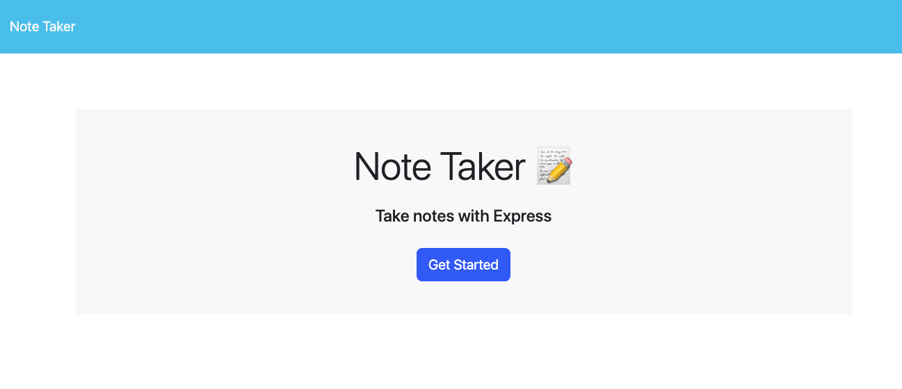
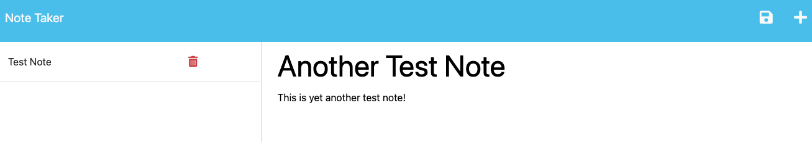

# note-taker
  
  ## Description

  ## Table of Contents
   -[Installation](#installation)

  -[Usage](#usage)

  -[Credits](#credits)

  -[Tests](#tests)

  -[License](#license)

  -[Questions](#questions)

  ## Installation
  The app is currently deployed at https://mighty-springs-69192-49479b06d050.herokuapp.com/

  ## Usage
  On the homepage you can click the "Get Started" button to take you to the section containing the notes.
  

  Once on the notes page you can enter a new note by click the plus icon in the top right, and clicking in the respective fields in the right column will allow you to enter text. Once you have entered your desired note you can click the save icon in the top right. You can select previously entered notes on the right to view them or click on the red trashcan to delete previously saved notes.
  

  ## Credits
  This project makes use of express.js and node.js.

  ## Tests
  N/A

  ## License
  This project is licensed under the MIT license.
  ## Questions
  If you have any questions, please contact me at chasegarrett@tutanota.com. You can also visit my [GitHub](https://github.com/Chase-Garrett) for more of my work.
